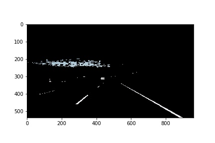
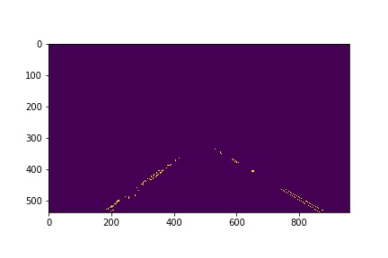
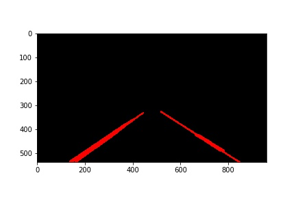
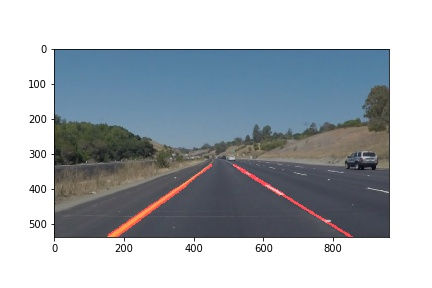
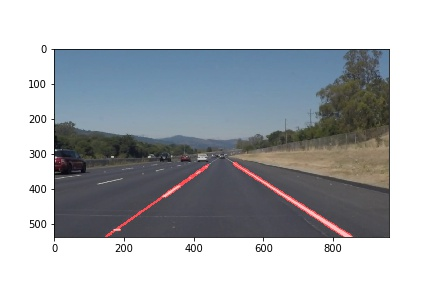

# Find Lane-Lines on the Road

### Overview
In this project I attempt to find lane line segments on road to guide self-driving car. The lines on the road that show us where the lanes are act as our constant reference for where to steer the vehicle. 

Tools are used :
* Python
* OpenCV
* Anaconda
* Jupiter Notebook (*.ipynb)

### Pipeline
The goal of the pipeline is to compose several different operations together, apply them to an image, and produce an annotated image that shows where a lane on a road would be.

My pipeline consists of steps:
* Apply a color mask to suppress unwanted portion of images/videos
* Apply grayscale
* Performing edge detection
* Selecting regions to search for lane lines boundary
* Extrapolate line segments
* Apply Hough transform and draw line segments

### Original Image

<figure>
 
 <figcaption>
 

 
 </figcaption>
</figure>

### Image with White Mask

<figure>
 
 <figcaption>
 

 
 </figcaption>
</figure>

### Image with selected region

<figure>
 
 <figcaption>
 

 
 </figcaption>
</figure>

### Image with Hough transformed

<figure>
 
 <figcaption>
 

 
 </figcaption>
</figure>

### Images with Connecting Line Segments

<figure>

</figure>

 
<figure>
 
 <figcaption>
 

 
 </figcaption>
</figure>

### Reflection

Line successfully combined on video stream. However, numbers of flaw still occur specifically on challenge.mp4 video. Annotated version of video and images can be found on "test_video_output" and "test_images_output" folders.

### Potential shortcomings

The challenge video show couples flaws on methods as follow:
* Highly sensitive to color change of the environment
* Requires some hard coded variables
* Quality of result dependend on lane location on images

### Possible improvements
* Need more videos to train and improve pipeline
* Better methodology to determine sensitive variable on pipeline and adjust automatically
* Automatically calculate region of interest and color mask range

### Files
* Original images and videos on test_images and test_videos folder
* Processed images and videos on test_images_output and test_videos_output folder

